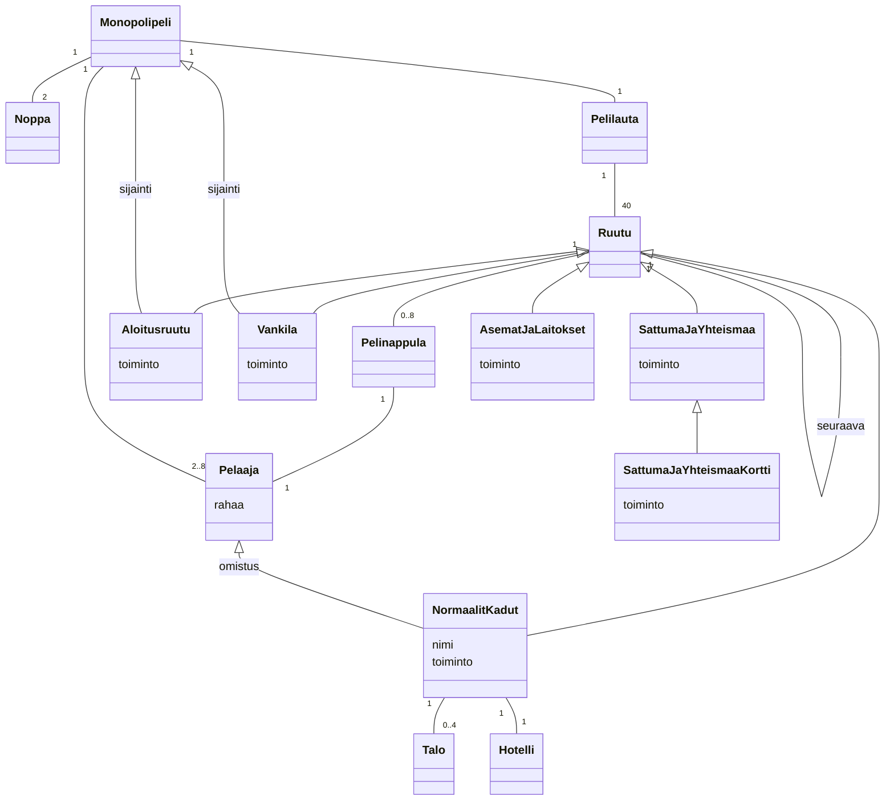

```mermaid
 classDiagram
    Monopolipeli "1" -- "2" Noppa
    Monopolipeli "1" -- "1" Pelilauta
    Pelilauta "1" -- "40" Ruutu
    Ruutu "1" -- "1" Ruutu : seuraava
    Ruutu "1" -- "0..8" Pelinappula
    Pelinappula "1" -- "1" Pelaaja
    Pelaaja "2..8" -- "1" Monopolipeli
    
    class Pelaaja{
	rahaa
    }

    Ruutu <|-- Aloitusruutu
    Ruutu <|-- Vankila     
    Ruutu <|-- SattumaJaYhteismaa
    Ruutu <|-- AsematJaLaitokset
    Ruutu <|-- NormaalitKadut
    
    Monopolipeli <|-- Aloitusruutu : sijainti
    Monopolipeli <|-- Vankila : sijainti  	
    
    Pelaaja <|-- NormaalitKadut : omistus

    class Aloitusruutu{
	toiminto
    }

    class Vankila{
        toiminto
    }

    class SattumaJaYhteismaa{
        toiminto
    }

    class AsematJaLaitokset{
	toiminto
    }

    class NormaalitKadut{
        nimi
	toiminto
    }

    SattumaJaYhteismaa <|-- SattumaJaYhteismaaKortti
    class SattumaJaYhteismaaKortti{
	toiminto
    }

    NormaalitKadut "1" -- "0..4" Talo
    NormaalitKadut "1" -- "1" Hotelli
     
```
