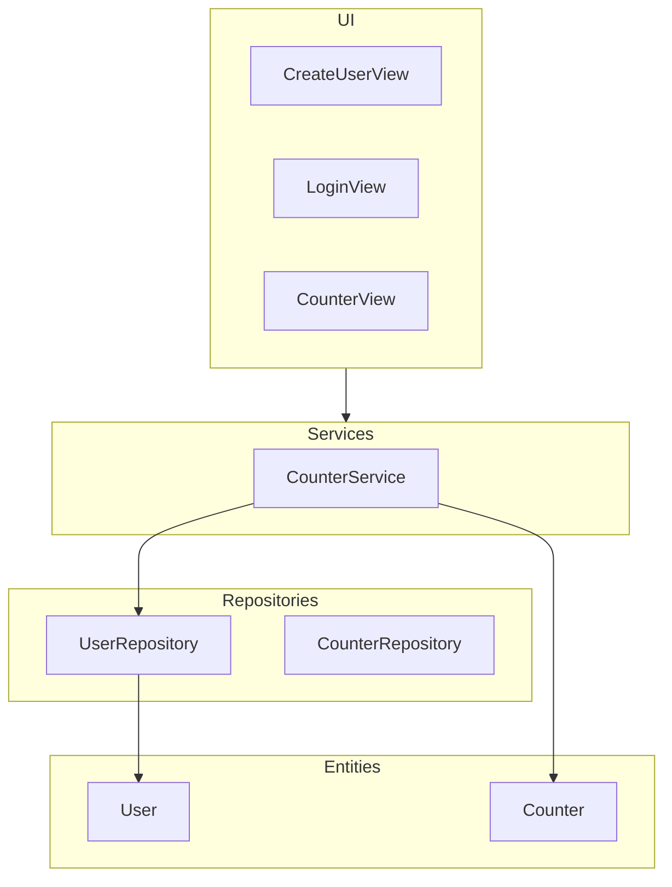
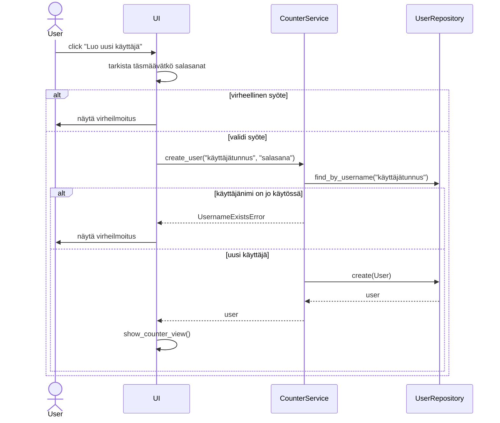

# Arkkitehtuurikuvaus

## Rakenne

## Päätoiminnallisuudet

### Uuden käyttäjän luominen

Kun halutaan luoda uusi käyttäjätunnus, painetaan kirjautumissivulla olevaa painiketta "Luo uusi käyttäjä".
Käyttäjälle aukeaa uusi sivu, johon käyttäjä syöttää uuden käyttäjätunnuksen. Käyttäjätunnuksen tulee olla uniikki. 
Sovellus antaa virheilmoituksen mikäli käyttäjätunnus on jo käytössä. Käyttäjätunnuksen jälkeen käyttäjä syöttää valitsemansa salasanan. 
Tämän jälkeen käyttäjä syöttää salasanan uudestaan ja sen tulee täsmätä aiemmin annettuun salasanaan. Mikäli salasanat eivät täsmää, 
sovellus antaa virheilmoituksen. Syötettyään tiedot käyttäjä painaa "Luo käyttäjä"-painiketta ja sovellus kirjaa käyttäjän sisälle järjestelmään. 

Alla sekvenssikaavio uuden käyttäjän luomisesta:

 

