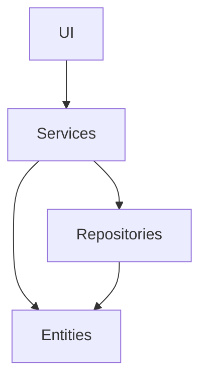
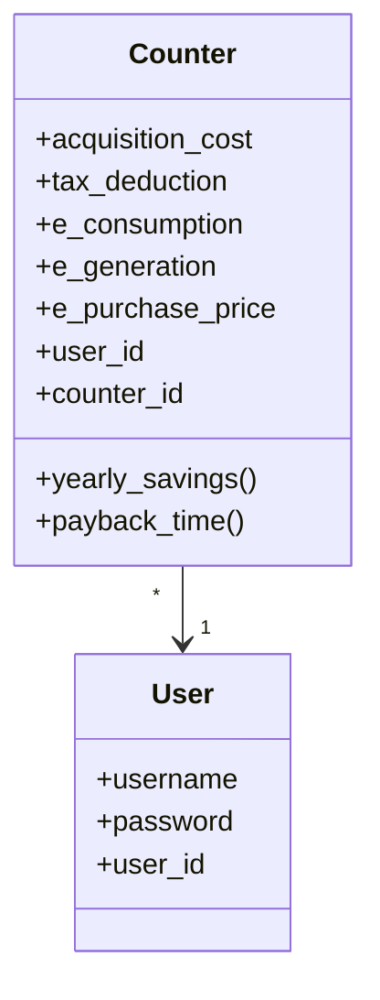
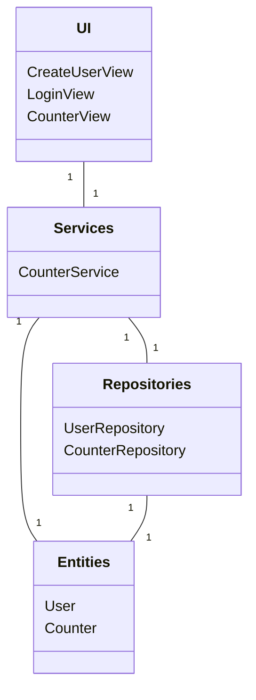
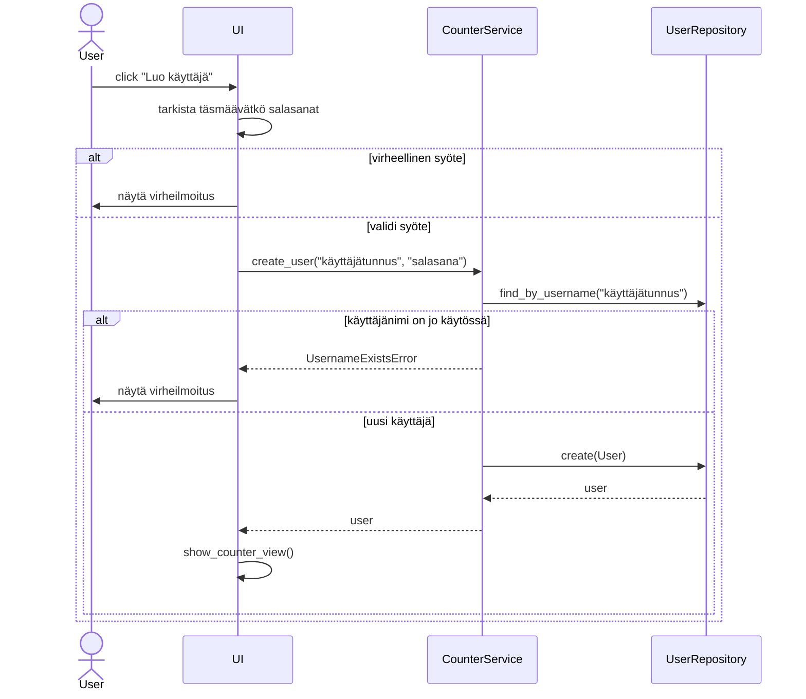
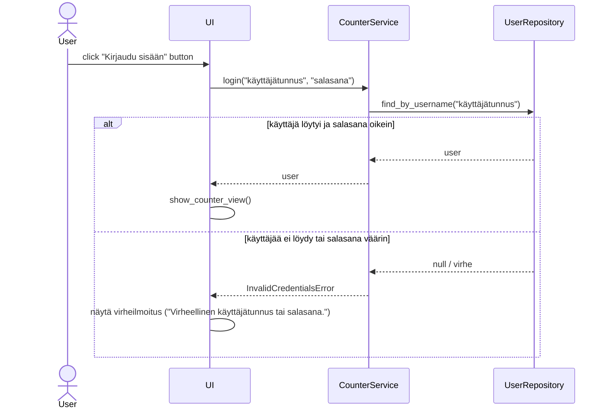
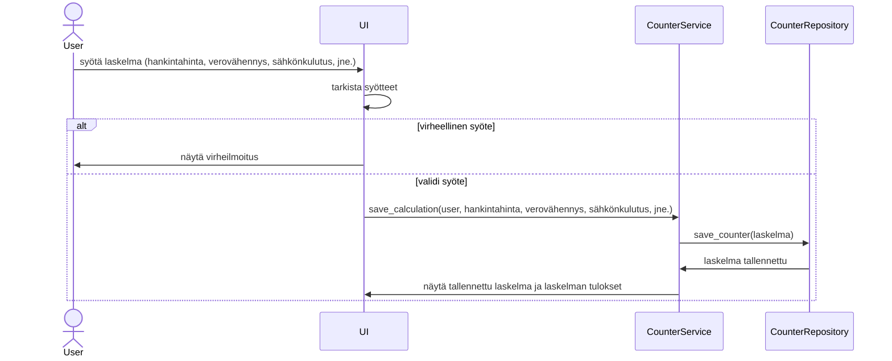

# Arkkitehtuurikuvaus

## Rakenne

Ohjelman rakenne on esitetty alla olevassa kaaviossa. Rakenne noudattaa kolmitasoista kerrosarkkitehtuuria. _UI_-pakkaus vastaa sovelluksen käyttöliittymästä, _Services_-pakkaus sovelluslogiikasta ja _Repositories_-pakkaus vastaa sovelluksen tietokantaoperaatioista. _Entities_-pakkaus sisältää luokat, jotka kuvaavat sovelluksen käyttämiä tietomalleja.

## Käyttöliittymä

Käyttöliittymässä on kolme erilaista näkymää, joista jokainen on kerrallaan näkyvänä:

- Sisäänkirjautuminen
- Uuden käyttäjän luominen
- Laskuri

Käyttöliittymän näkymät on toteutettu omina luokkinaan ja niiden näyttämisestä vastaa [UI](../src/ui/ui.py)-luokka. Käyttöliittymä on eristetty sovelluslogiikasta ja se ainoastaan kutsuu CounterService-luokan metodeja.

## Sovelluslogiikka

Sovelluksessa käytettäviä tietomalleja ovat luokat [User](../src/entities/user.py) ja [Counter](../src/entities/counter.py). Counter-luokka kuvaa aurinkopaneelilaskuria ja User-luokka kuvaa käyttäjätunnuksen luonutta käyttäjää.

Luokka [CounterService](../src/services/counter_service.py) tarjoaa käyttöliittymän toiminnoille metodeja, kuten:

- `create_user(username, password)`
- `login(username, password)`
- `save_calculation(user, acquisition_cost, tax_deduction, e_consumption, e_generation, e_purchase_price)`
- `delete_counter(counter_id)`

_repositories_-pakkauksessa sijaitsee luokat [UserRepository](../src/repositories/user_repository.py) ja [CounterRepository](../src/repositories/counter_repository.py), jotka vastaavat tietojen tallennuksesta. CounterServises pääsee näiden luokkien kautta käsiksi käyttäjiin ja laskureihin.

Alla ohjelman osien suhdetta kuvaava luokkakaavio.

## Tietojen pysyväistallennus

_repositories_-pakkauksen luokat [UserRepository](../src/repositories/user_repository.py) ja [CounterRepository](../src/repositories/counter_repository.py) vastaavat tietojen tallennuksesta. Nämä luokat tallentavat tietoa SQLite-tietokantaan.

Käyttäjät tallennetaan SQLite-tietokannan tauluun `users` ja laskelmat tallennetaan SQLite-tietokannan tauluun `calculations`. Taulut alustetaan [initialize_database.py](../src/initialize_database.py)-tiedostossa.

## Päätoiminnallisuudet

Alla kuvattuna ohjelman toimintalogiikkaa sekvenssikaavioina.

### Uuden käyttäjän luominen

Kun halutaan luoda uusi käyttäjätunnus, painetaan kirjautumissivulla olevaa painiketta _Luo uusi käyttäjä_.
Käyttäjälle aukeaa uusi sivu, johon käyttäjä syöttää uuden käyttäjätunnuksen. Käyttäjätunnuksen tulee olla uniikki.
Sovellus antaa virheilmoituksen mikäli käyttäjätunnus on jo käytössä. Käyttäjätunnuksen jälkeen käyttäjä syöttää valitsemansa salasanan.
Tämän jälkeen käyttäjä syöttää salasanan uudestaan ja sen tulee täsmätä aiemmin annettuun salasanaan. Mikäli salasanat eivät täsmää,
sovellus antaa virheilmoituksen. Syötettyään tiedot käyttäjä painaa _Luo käyttäjä_-painiketta ja sovellus kirjaa käyttäjän sisälle järjestelmään.

Alla sekvenssikaavio uuden käyttäjän luomisesta:

Kun _Luo käyttäjä_-painiketta painetaan, tarkistetaan, että syöte on validi. Mikäli syöte on validi, tapahtumankäsittelijä kutsuu _CounterService_-luokan metodia `create_user`. Metodin parametreina annetaan luotavan käyttäjän tiedot. Sovelluslogiikka selvittää _UserRepository_-luokan avulla, onko käyttäjätunnus jo olemassa. Mikäli käyttäjätunnus ei ole vielä käytössä, sovelluslogiikka luo _User_-olion ja tallettaa sen kutsumalla _UserRepositoryn_ metodia `create`. Tällöin käyttäjä kirjataan sisään ja _UI_ vaihtaa näkymäksi _CounterView_-näkymän.

### Käyttäjän sisäänkirjaantuminen

Kun käyttäjä haluaa kirjautua sisään olemassa olevilla käyttäjätunnuksilla, hän syöttää käyttäjätunnuksen ja salasanan kenttiin ja painaa _Kirjaudu sisään_-painiketta. Oikeat tunnukset syötettyään käyttäjä siirretään laskuri-näkymään. Virheellisten tunnusten tilanteessa käyttäjälle näytetään virheviesti.

Kirjautuessaan sisään käyttäjä syöttää tunnuksensa ja painaa _Kirjaudu sisään_-painiketta. Tapahtumankäsittelijä kutsuu _CounterService_-luokan `login`-metodia käyttäjän syöttämillä parametreilla. Tämän jälkeen _CounterService_ kutsuu _UserRepository_-luokan `find_by_username`-metodia. _UserRepository_ palauttaa User-olion, mikäli käyttäjä löytyi _CounterService_ palauttaa User-olion _UI_-kerrokselle ja _UI_ vaihtaa näkymäksi _CounterView_-näkymän. Mikäli käyttäjää ei löydy tai salasana on väärin, _UI_ näyttää virheilmoituksen.

### Uuden laskelman luominen

Uuden laskelman luominen tapahtuu kirjautumalla sisään sovellukseen ja syöttämällä laskurin kenttiin vaaditut tiedot. Mikäli syöte on virheellinen (esim. väärä desimaalierotin tai negatiivinen luku), antaa ohjelma virheilmoituksen. Validi syöte hyväksytään ja laskelma tallennetaan. Tallennettuun laskelmaan lisätään myös käyttäjän ID-tieto, jotta kyseinen käyttäjä voi myös myöhemmin tarkastella myöhemmin tekemiään laskelmia.

Kun käyttäjä painaa _Luo laskelma_-painiketta, tarkistetaan _UI_-tasolla, että syötteet ovat validit. Jos syöte on virheellinen, näytetään käyttäjälle virheilmoitus. Kun syöte on validi, käyttöliittymä kutsuu palvelua save_calculation, joka ottaa mukaan käyttäjän tiedot sekä syötetyt tiedot. Tämän jälkeen _CounterService_ kutsuu _CounterRepository_ luokkaa tallentamaan laskelman tiedot tietokantaan. Tämän jälkeen _CounterRepository_  vahvistaa _CounterService_-luokalle, että laskelma on tallennettu ja _CounterService_ palauttaa tiedon onnistuneesta tallennuksesta sekä laskelman tulokset _UI_-luokalle.