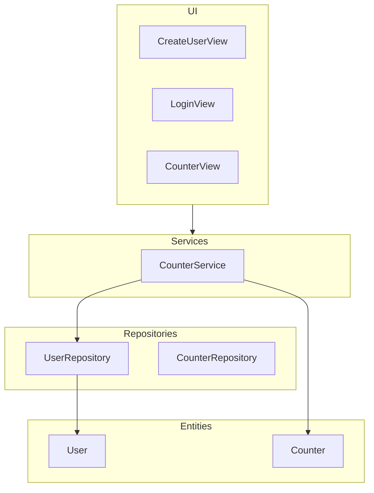

# Arkkitehtuurikuvaus

## Rakenne

```mermaid
 graph TD
    subgraph "UI"
        U1[CreateUserView]
        U2[LoginView]
        U3[CounterView]
    end

    subgraph "Services"
        S1[CounterService]
    end

    subgraph "Repositories"
        R1[UserRepository]
        R2[CounterRepository]
    end

    subgraph "Entities"
        E1[User]
        E2[Counter]
    end

    UI --> Services
    S1 --> R1
    R1 --> E1
    S1 --> E2
```
