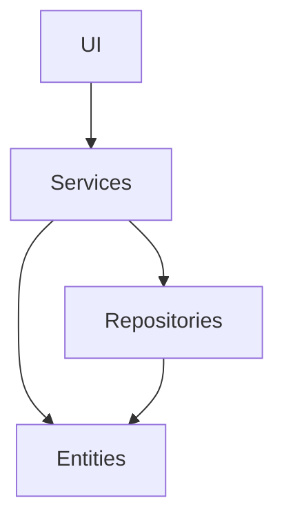
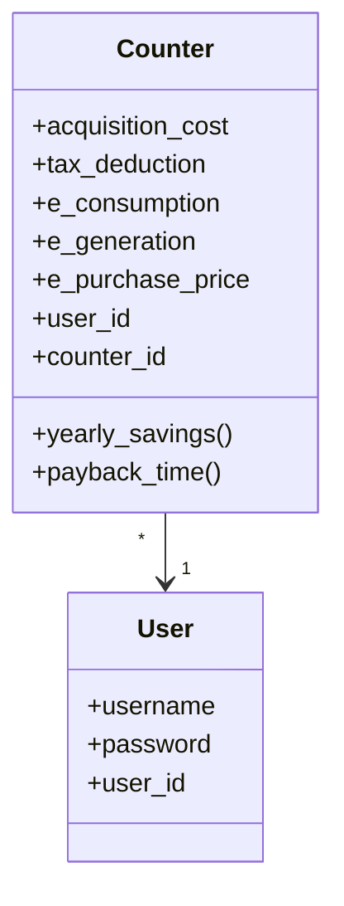
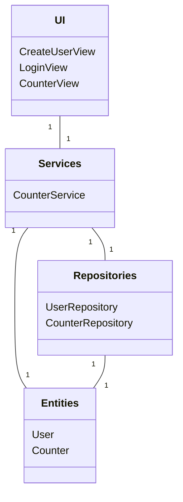
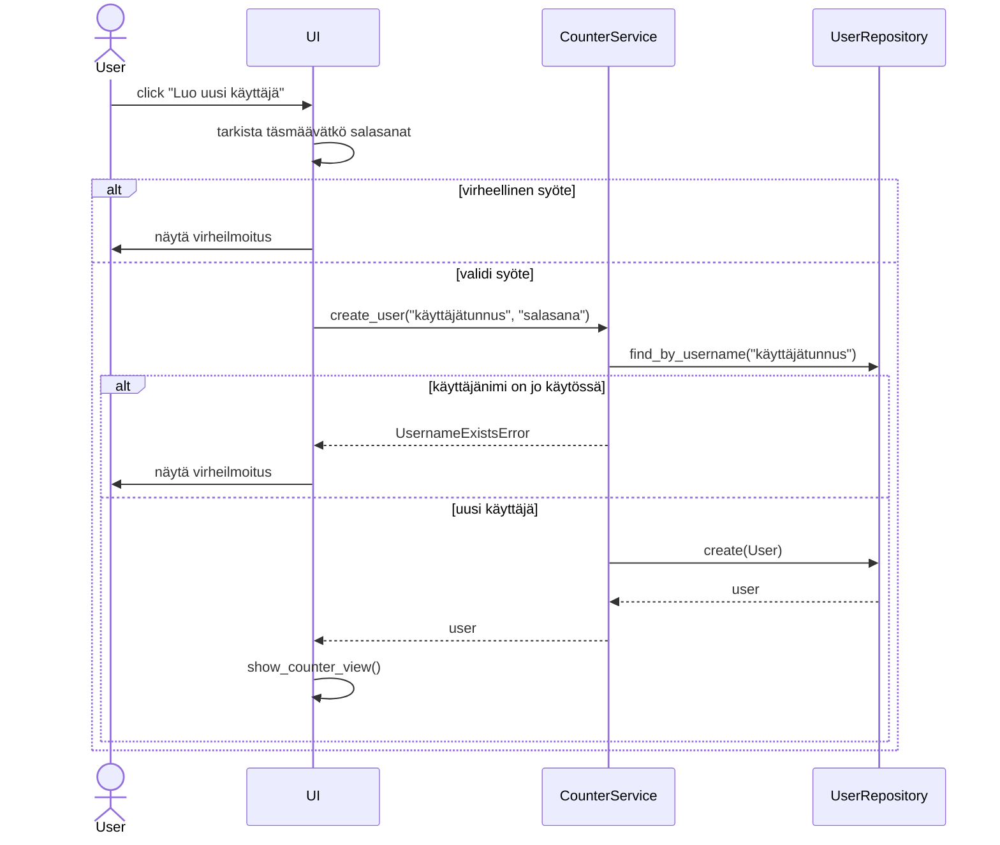

# Arkkitehtuurikuvaus

## Rakenne

Ohjelman rakenne on esitetty alla olevassa kaaviossa. Rakenne noudattaa kolmitasoista kerrosarkkitehtuuria. _UI_-pakkaus vastaa sovelluksen käyttöliittymästä, _Services_-pakkaus sovelluslogiikasta ja Repositories_-pakkaus vastaa sovelluksen tietokantaoperaatioista. _Entities-pakkaus sisältää luokat, jotka kuvaavat sovelluksen käyttämiä tietomalleja.

## Käyttöliittymä

## Sovelluslogiikka

Sovelluksessa käytettäviä tietomalleja ovat luokat  ja . Counter-luokka kuvaa aurinkopaneelilaskuria ja User-luokka kuvaa käyttäjätunnuksen luonutta käyttäjää.

Alla sovellusta kuvaava luokkakaavio.

## Päätoiminnallisuudet

### Uuden käyttäjän luominen

Kun halutaan luoda uusi käyttäjätunnus, painetaan kirjautumissivulla olevaa painiketta "Luo uusi käyttäjä".
Käyttäjälle aukeaa uusi sivu, johon käyttäjä syöttää uuden käyttäjätunnuksen. Käyttäjätunnuksen tulee olla uniikki.
Sovellus antaa virheilmoituksen mikäli käyttäjätunnus on jo käytössä. Käyttäjätunnuksen jälkeen käyttäjä syöttää valitsemansa salasanan.
Tämän jälkeen käyttäjä syöttää salasanan uudestaan ja sen tulee täsmätä aiemmin annettuun salasanaan. Mikäli salasanat eivät täsmää,
sovellus antaa virheilmoituksen. Syötettyään tiedot käyttäjä painaa "Luo käyttäjä"-painiketta ja sovellus kirjaa käyttäjän sisälle järjestelmään.

Alla sekvenssikaavio uuden käyttäjän luomisesta:

