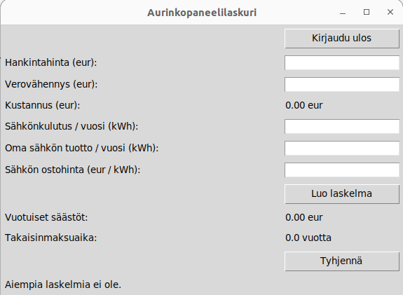
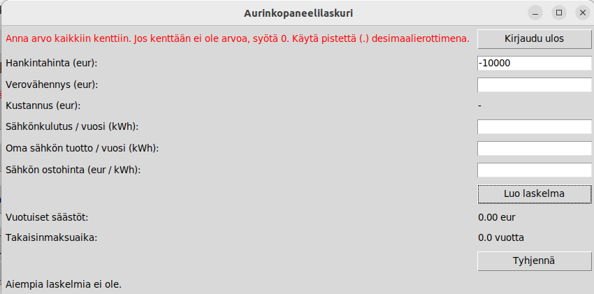
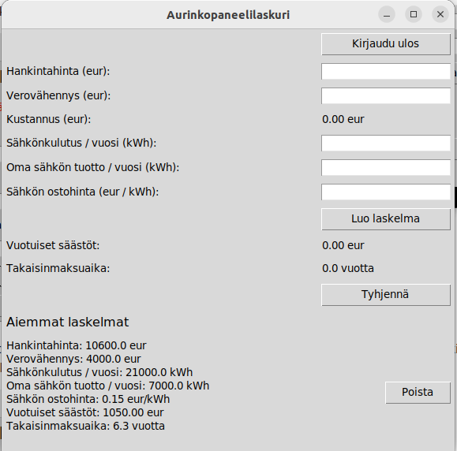

# Käyttöohje

Lataa projektin viimeisimmän releasen koodi [täältä](https://github.com/varkkha/ot-harjoitustyo/releases).

## Konfigurointi

Tallennukseen käytettävän tietokannan nimeä voi halutessaan konfiguroida käynnistyshakemiston _.env_-tiedostossa. Mikäli tiedostoja ei ole vielä _data_-hakemistossa, ne luodaan sinne automaattisesti. Tiedoston muoto on seuraava:

```bash
DATABASE_FILENAME=database.sqlite
```

## Ohjelman käynnistäminen

Noudata seuraavia ohjeita käynnistääksesi ohjelman.

1. Asenna riippuvuudet komennolla:

```bash
poetry install
```

2. Suorita alustustoimenpiteet komennolla:

```bash
poetry run invoke build
```

3. Käynnistä ohjelma komennolla:

```bash
poetry run invoke start
```

## Ohjelman käyttö

### Kirjautuminen

Ohjelma avautuu sisäänkirjautumisnäkymään. Tästä näkymästä pääsee kirjautumaan sisään olemassaolevilla käyttäjätunnuksilla syöttämällä käyttäjätunnuksen ja salasanan ja painamalla _Kirjaudu sisään_.


### Uuden käyttäjän luominen

Mikäli käyttäjällä ei ole vielä tunnuksia, tunnukset pääsee luomaan painamalla _Luo uusi käyttäjä_-nappia. Tämän napin takaa avautuu sivu, jossa uudet tunnukset on mahdollista luoda.


Käyttäjätunnus-kohtaan tulee syöttää uniikki käyttäjätunnus, joka on vähintään yhden merkin pituinen. Ohjelma antaa virheviestin, mikäli syötetty tunnus on jo käytössä.


Uniikin käyttäjätunnuksen jälkeen syötetään salasana, joka ei voi olla tyhjä. Sama salasana tulee syöttää uudelleen. Mikäli salasanat eivät täsmää keskenään, ohjelma antaa virheviestin.


Validin käyttäjätunnuksen ja salasanan syötettyä painetaan _Luo käyttäjä_-painiketta  ja ohjelma kirjaa käyttäjän sisälle sovellukseen. Mikäli käyttäjä ei haluakaan luoda uutta tunnusta, voi hän painaa _Takaisin_-painiketta, joka ohjaa takaisin sisäänkirjautumisnäkymään.

### Laskurin käyttö

Kun käyttäjä on kirjautunut sisään sisäänkirjautumisnäkymässä tai luonut uudet tunnukset, pääsee hän käyttämään laskuria.



Laskuriin syötetään pyydetyt tiedot niille varattuihin kenttiin:

- Hankintahinta: Aurinkopaneeleista maksettu bruttosumma (eur)
- Verovähennys: Aurinkopaneeleiden hankintahinnasta saatava kotitalousvähennys (eur). Aurinkopaneeleiden asentaminen on palvelu, joka oikeuttaa kotitalousvähennykseen.
- Kustannus: Tämä kenttä laskee automaattisesti aurinkopaneeleiden nettosumman vähentämällä syötetystä hankintahinnasta syötetyn verovähennyksen.
- Sähkönkulutus / vuosi: Arvio vuosittaisesta kokonaissähkönkulutuksesta (kWh)
- Oma sähkön tuotto / vuosi: Arvio vuosittaisesta tuotosta, jonka aurinkopaneelit tuottavat (kWh)
- Sähkön ostohinta: Keskimääräinen arvio sähkön ostohinnasta (eur/kWh)

Kenttiin tulee syöttää vain ei-negatiivisia numeroarvoja. Kaikkiin kenttiin tulee syöttää jotain, eli jos kustannus on nolla, niin tulee syöttää 0. Desimaalierottimena tulee käyttää pistettä. Mikäli kenttiin annetaan virheellinen syöte, antaa ohjelma virheilmoituksen.



Kun kenttiin on syötetty validit arvot, painetaan _Luo laskelma_ ja ohjelma laskee annettujen lukujen pohjalta vuotuiset säästöt sekä aurinkopaneeleiden takaisinmaksuajan ("kuoletusajan").

Laskuriin syötetyt tiedot voi tyhjentää painamalla _Tyhjennä_-painiketta.

Mikäli käyttäjällä ei ole aiempia laskelmia, näkyy laskurin alla teksti _Aiempia laskelmia ei ole_. Kun käyttäjä laatii uuden laskelman, tallettuu laskelma aiempien laskelmien listaan.



Käyttäjä voi halutessaan poistaa laskelmia aiempien laskelmien listasta painamalla _Poista_-painiketta.

Käyttäjä voi kirjautua ulos laskurista painamalla laskurin oikeassa yläkulmassa näkyvää _Kirjaudu ulos_-painiketta.