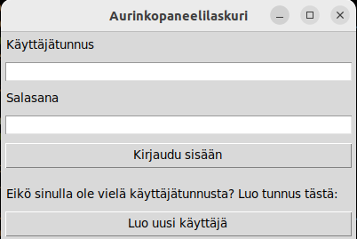
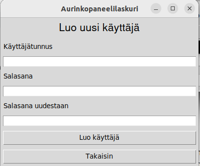
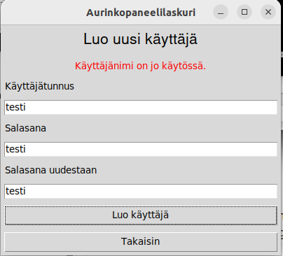
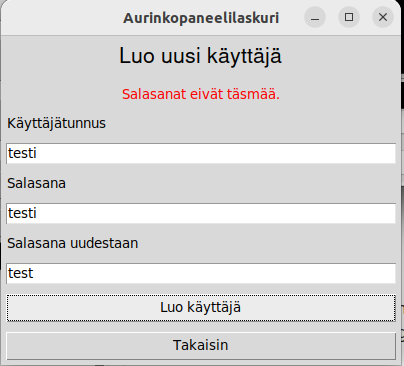

# Käyttöohje

Lataa projektin viimeisimmän releasen koodi [täältä](https://github.com/varkkha/ot-harjoitustyo/releases).

## Ohjelman käynnistäminen

Noudata seuraavia ohjeita käynnistääksesi ohjelman.

1. Asenna riippuvuudet komennolla:

```bash
poetry install
```

2. Suorita alustustoimenpiteet komennolla:

```bash
poetry run invoke build
```

3. Käynnistä ohjelma komennolla:

```bash
poetry run invoke start
```

## Ohjelman käyttö

### Kirjautuminen

Ohjelma avautuu sisäänkirjautumisnäkymään. Tästä näkymästä pääsee kirjautumaan sisään olemassaolevilla käyttäjätunnuksilla syöttämällä käyttäjätunnuksen ja salasanan ja painamalla "Kirjaudu sisään".



### Uuden käyttäjän luominen

Mikäli käyttäjällä ei ole vielä tunnuksia, tunnukset pääsee luomaan painamalla "Luo uusi käyttäjä"-nappia. Tämän napin takaa avautuu sivu, jossa uudet tunnukset on mahdollista luoda.



Käyttäjätunnus-kohtaan tulee syöttää uniikki käyttäjätunnus. Ohjelma antaa virheviestin, mikäli syötetty tunnus on jo käytössä.



Uniikin käyttäjätunnuksen jälkeen syötetään salasana, jonka tulee olla vähintään kaksi merkkiä pitkä. Sama salasana tulee syöttää uudelleen. Mikäli salasanat eivät täsmää keskenään, ohjelma antaa virheviestin.

