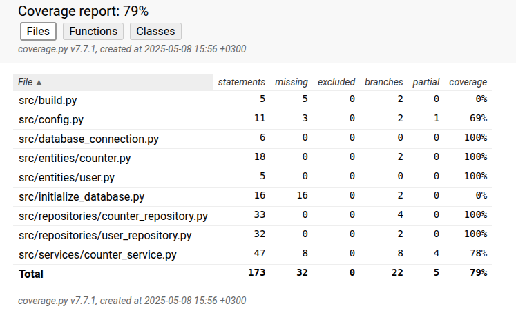

# Testausdokumentti

Ohjelmaa on testattu automatisoitujen unit- ja integraatiotestein. Järjestelmätaso on testattu manuaalisesti suoritettujen testien avulla.

## Yksikkö- ja integraatiotestaus

### Sovelluslogiikka

Sovelluslogiikasta vastaava _CounterService_-luokka testataan [TestCounterService](../src/tests/counter_service_test.py)-testiluokalla. CounterService-olio alustetaan testissä niin, että sille injektoidaan riippuvuuksiksi CounterRepository- ja UserRepository-oliot, jotka käyttävät SQLite-tietokantaa testitiedostona. Jokainen testi käyttää erillistä testitietokantaa, joka luodaan tyhjästä ennen testien suorittamista. Tietokantaan luodaan users- ja calculations-taulut SQL-kyselyillä.

Testiluokassa varmistetaan muun muassa, että sähkön nettokulutus lasketaan oikein `calculate_net_consumption`-metodilla, laskelman tallennus tietokantaan onnistuu oikein `save_calculation`-metodin avulla ja että uuden käyttäjän luonti toimii odotetusti.

### Repositorio-luokat

Sovelluksen laskelmien tallennuksesta vastaavaa _CounterRepository_-luokkaa testataan [TestCounterRepository](../src/tests/counter_repository_test.py)-testiluokalla. Testissä alustetaan SQLite-pohjainen testitietokanta, johon luodaan calculations-taulu ennen jokaisen testin suorittamista. Jokaisessa testissä käytetään uutta tietokantatiedostoa, jotta testit eivät vaikuta toisiinsa.

Testiluokassa varmistetaan muun muassa, että laskelman tallennus tietokantaan onnistuu ja `get_all_calculations` palauttaa tallennetut laskelmat ja että laskelma voidaan poistaa tietokannasta `delete`-metodin avulla.

Käyttäjien tallennuksesta ja hausta vastaavaa _UserRepository_-luokkaa testataan [TestUserRepository](../src/tests/user_repository_test.py)-testiluokalla. Jokaisessa testissä käytetään SQLite-tietokantaa, johon alustetaan users-taulu. Testidatan pysyvyys varmistetaan luomalla tietokanta uudelleen ennen jokaista testitapausta.

Testiluokassa testataan, että `delete_all`-metodi tyhjentää users-taulun onnistuneesti ja että `find_by_username` palauttaa None, jos haettua käyttäjää ei löydy tietokannasta.

### Tietomalli-luokat

Laskurin tietoja kuvaavaa _Counter_-entiteettiä testataan [TestCounter](../src/tests/counter_entity_test.py)-testiluokassa. Testeissä luodaan _Counter_-olio valmiilla arvoilla, ja testataan sen ominaisuuksien alustusta sekä laskennallisia ominaisuuksia.

Käyttäjä-oliota kuvaavaa _User_-entiteettiä testataan [TestUser](../src/tests/user_entity_test.py)-testiluokassa. Testissä luodaan käyttäjä username, password ja user_id -kentillä, ja varmistetaan että arvot tallentuvat oikein.

### Testauskattavuus

Sovelluksen testauksen haarautumakattavuus on 79 % ilman käyttöliittymäkerrosta.

Testaamatta jäi build.py sekä initialize_database.py. Lisäksi config.py-tiedostosta testaamatta jäi FileNotFoundError-tilanteet ja counter_service.py-tiedostosta muutamia tilanteita.

## Järjestelmätestaus

Sovelluksen järjestelmätestaus suoritettiin manuaalisesti.

### Toiminnallisuudet

Kaikki toiminnallisuudet, jotka on listattu vaatimusmäärittelyssä ja käyttöohjeessa, on testattu. Lisäksi kaikkien toiminnallisuuksien yhteydessä on yritetty antaa virheellisiä syötteitä.