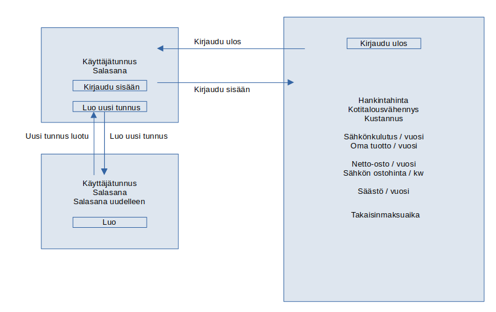

# Vaatimusmäärittely

## Sovelluksen tarkoitus

Laskuri aurinkopaneelien takaisinmaksuajasta.
Käyttäjä syöttää laskuriin aurinkopaneelien hankintaan ja sähkönkulutukseen liittyviä perustietoja. 
Näiden tietojen pohjalta laskuri laskee ajan, jonka kuluessa aurinkopaneelien hankintahinta on saatu kuoletettua.

## Käyttäjät

Laskurilla on yksi peruskäyttäjärooli.

## Käyttöliittymäluonnos

## Perusversion tarjoama toiminnallisuus

- (Tehty) Käyttäjä voi luoda itselleen käyttäjätunnuksen ja salasanan
	- (Tehty) Käyttäjätunnuksen tulee olla uniikki
	- (Tehty) Salasanojen tulee täsmätä
- (Tehty) Käyttäjä voi kirjautua järjestelmään
	- (Tehty) Käyttäjätunnuksen ja salasanan tulee täsmätä
	- (Tehty) Jos käyttäjätunnus tai salasana ei täsmää, niin järjestelmä antaa virheilmoituksen
- (Tehty) Käyttäjä voi kirjautua ulos järjestelmästä
- (Tehty) Käyttäjä voi syöttää laskuriin tiedot
	- Tyhjiä kenttiä ei voi palauttaa, tällöin järjestelmä antaa virheilmoituksen
- (Tehty) Käyttäjä voi nähdä laskuriin syöttämänsä tiedot sekä laskurin laskeman tuloksen
- Käyttäjä voi nähdä aiemman laskelmansa ja poistaa vanhan laskelman

## Jatkokehitysideoita

- Ylläpitäjäroolin lisääminen
- Ylläpitäjille mahdollisuus päivittää tilastotietoja
- Peruskäyttäjä voi syöttää useamman aurinkopaneelitehtaan tiedot
